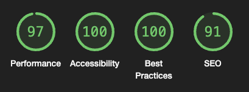

# Nuxt 3 Minimal Starter



[](https://app.netlify.com/sites/nuxt3-tmp/deploys)

Live demo: [nuxt3-tmp.netlify.app](https://nuxt3-tmp.netlify.app)

## ToDo?

Любое техническое решение рационально применять только тогда, когда оно не противоречит здравому смыслу.

Объем задач, при их качественном выполнении, превышает разумное время для выполнения тестового задания.

Я уже потратил достаточно времени на конфикт версий, при развёртке проекта через `create-nuxt-app`, после чего я какое-то время сомневался, что его стоит продолжать.

Затем, из интереса к Nuxt 3, я захотел сделать из этого конфетку, но подустал.

По этому я решил уточнить некоторые моменты, перед тем, как тем как приступить к их выполнению, если их выполнение вообще необходимо:

### API:

- Реализовать простое API с помощью Nuxt.js (например, используя `@nuxtjs/axios` или встроенные возможности). ( **API или обёртку над API?** )
- Хранить данные постов в формате JSON на сервере. ( **это что бы упростить задачу фронту или усложнить задачу бэку?** )
- Обеспечить возможность получения списка постов и получения данных по отдельному посту ( **это можно реализовать, но проблема с сервером останется** )

Nuxt 3 поддеживает создания сервера внутри репозитория, но это ещё не означает, что это - лучшее решение.
Я бы предпочёл написать сервер на профессиональном серверном фреймворке, типа **Nest**/Spring/Gin/Flask/..., но что-то мне подсказывает, что это многовато для тестового задания.

### Функционал:

- **Админка:** (остаётся вопрос с сервером)

  - Реализовать простую форму для добавления новых постов. Форма должна содержать поля: заголовок, краткое описание и полный текст.

### Стилизация:

- Использовать SCSS для стилизации: сейчас используется **Tailwind + SCSS**. К SCSS стилям применяются стили Tailwind через `@apply`.
- Реализовать адаптивный дизайн: прибить футер, добавить бутерброд в меню, картинки (которых нет) сделать адаптивными, добавить `@media` запросы для разных разрешений экрана.

### Дополнительные требования:

- Использовать Vuex для управления состоянием. (можно через `@pinia/nuxt`, который является более коробочным для Nuxt 3)

### Авторизация:

- Можно, но нужно ли? (просто вопрос)

### Подытожим:

Давайте считать это промежуточным решением, которое можно доделать, только если это будет необходимо.

Дальнейшая разработка уже напоминает мне разработку полноценного продукта, а тут нужна уже заинтересованность.

В качестве дополнитеной самомотивации, я пилил этот проект, что бы я смог его переиспользовать в дальшейшем, для быстрой развертки сайта, к примеру на Netlify, но дальнейшая его разработка будет уже отклонением от задачи, ну и это и не за 1 вечер делается.

## Code formatting

Format the code with Prettier:

```bash
# npm
npm run format

# pnpm
pnpm run format

# yarn
yarn format

# bun
bun run format
```


## Setup

Make sure to install the dependencies:

```bash
# npm
npm install

# pnpm
pnpm install

# yarn
yarn install

# bun
bun install
```

## Development Server

Start the development server on `http://localhost:3000`:

```bash
# npm
npm run dev

# pnpm
pnpm run dev

# yarn
yarn dev

# bun
bun run dev
```

## Production

Build the application for production:

```bash
# npm
npm run build

# pnpm
pnpm run build

# yarn
yarn build

# bun
bun run build
```

## Production Preview

Locally preview production build:

```bash
# npm
npm run preview

# pnpm
pnpm run preview

# yarn
yarn preview

# bun
bun run preview
```

Build the application for production and preview it locally:

```bash
# npm
npm run prod

# pnpm
pnpm run prod

# yarn
yarn prod

# bun
bun run prod
```

## Deployment to Netlify:

1. Fork this repository.
2. Create a new site on Netlify.
3. Connect your repository.
4. Set up environment variables:
   - `SERVER_PRESET` = `netlify_edge`
5. Set up `yarn build` as the build command.
